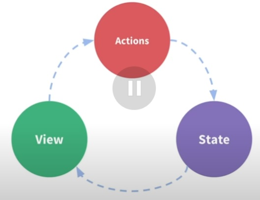

# Redux + ReactJS

REDUX nos resuelve la problematica del manejo de los estados, es mucho mas global y dinamico que el CONTEXT. Con REDUX podemos contar con una sola **fuente de la verdad**.
No forma parte (particularmente) de REACT, es otra forma que podemes optar para manejar los estados de una forma eficiente, siempre y cuando nuestra apliacion lo amerite. 



Lo que permite el **estado**, es poder renderizance en la VISTA, esto activa una ACCION que modfica el **estado** y el ciclo vuelve a empezar.


## Actions

Son objetos literales, que estan compuestos por dos propiedades, una que se llama TYPE y otra que se llama PAYLOAD.

TYPE: Que tipo de comportamiento queremos desencadenar con la ACTION. Admite un dato STRING.

PAYLOAD: Es la informacion que queremos enviar al ESTADO para que se actulice. Admite cualquier tipo de dato.

```
const addTodoAction = {
    type: 'todos/todoAdded',
    payload: 'Buy milk'
}
```

## Actions Creator

Reciben el PAYLOAD de forma dinámica y retorna un OBJETO, es una función.

## Reducers

Es una función que toma dos argumentos, el primero e inicial, será el STATE, y el segundo será la ACTION. 
Este función se va a encargar de actualizar el estado, toma este estado previo, el PAYLOAD.
No muta el estado (Ya que es inmutable), solo crea una nueva version de el.

```
const reducer = (state, action) => newState
```
Ejemplo:

```
const counterReducer = (state, action) => {
    const {type} = action

    if (type === '@counter/increment') {
        return state + 1
    }

    if (type === '@counter/decremented') {
        return state - 1
    }

    if (type === '@counter/reseted') {
        return 0
    }
}

const actionIncrement = {
    type: '@counter/incremented'
}

const actionDecremented = {
    type: '@counter/decremented'
}

const actionReset = {
    type: '@counter/reseted'
}

// Primer argumento es el State, y el segundo la Action
conterReducer(0, actionIncremented) // Output: 1
counterReducer(1, actionDecremented) // Output: 0
counterReducer(10, actionReset) // Output: 0
```
Normalmente se utiliza un SWITCH, en lugar de IF, pero de todas formas tampoco lo veriamos asi.


## Store

Aqui es donde se recibe todo el STATE de la aplicación. Es como unión de los REDUCERS y las ACTIONS.

```
import { configureStore } from '@reduxjs/toolkit'

const store = configureStore({ reducer: conterReducer })

console.log(store.getState())
// {value: 0}
```

Ejemplo:

```
import { createStore } from 'redux'


// Le damos un valor inicial al State
const conterReducer = (state = 0, action) => {
    switch (action.type) {
        case '@counter/incremented':
          return state + 1
        case '@counter/decremented':
          return state - 1
        case '@counter/reseted':
          return 0
    }
}


// Store
const store = createStore(counterReducer)


// Actions
const actionIncrement = {
    type: '@counter/incremented'
}

const actionDecremented = {
    type: '@counter/decremented'
}

const actionReset = {
    type: '@counter/reseted'
}

// Le pasamos la Action
store.dispatch(actionIncremented)

// Recuperamos el State
store.getState

```

### Dispatch

Es una funcion que **dispara** los ACTIONS CREATORS, los envia para que se ejecute el REDUCER.

```
store.dispatch({ type: 'counter/increment' })

console.log(store.getState())
// {value: 1}
```

## Base de datos del proyecto

Se utilizará, de forma práctica, una base de datos provisoria con una libreria llamada JSON-SERVER.

```
npm i json-server -D
```

Al instalarlo, lo unico q tenemos que crear, es una archivo JSON con los datos que necesitamos para este proyecto de ejemplo. Luego, vamos a modificar el SCRIPT del **package.json** colocando un nuevo comando:

```
"scripts": {
"server": "json-server --watch db.json"
}
```